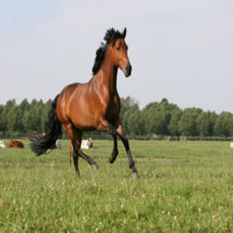
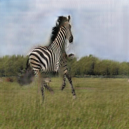
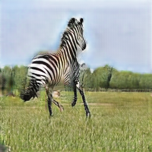

# CycleGAN

## Contrastive Learning for Unpaired Image-to-Image Translation
by Taesung Park, Alexei A. Efros, Richard Zhang, Jun-Yan Zhu

### Abstract
_In image-to-image translation, each patch in the output should reflect the content of the corresponding patch in the input, independent of domain. We propose a straightforward method for doing so -- maximizing mutual information between the two, using a framework based on contrastive learning. The method encourages two elements (corresponding patches) to map to a similar point in a learned feature space, relative to other elements (other patches) in the dataset, referred to as negatives. We explore several critical design choices for making contrastive learning effective in the image synthesis setting. Notably, we use a multilayer, patch-based approach, rather than operate on entire images. Furthermore, we draw negatives from within the input image itself, rather than from the rest of the dataset. We demonstrate that our framework enables one-sided translation in the unpaired image-to-image translation setting, while improving quality and reducing training time. In addition, our method can even be extended to the training setting where each "domain" is only a single image._
```
@misc{park2020contrastive,
      title={Contrastive Learning for Unpaired Image-to-Image Translation}, 
      author={Taesung Park and Alexei A. Efros and Richard Zhang and Jun-Yan Zhu},
      year={2020},
      eprint={2007.15651},
      archivePrefix={arXiv},
      primaryClass={cs.CV}
}
```

## Train/Test

- Download a dataset (e.g. horse2zebra):
```bash
bash ./datasets/download_cyclegan_dataset.sh horse2zebra
```

- Train a model:
```bash
python train.py
```
To see more intermediate results, check out `./saved_images_CUT/train/`.
- Test the model:
```bash
python test.py
```

The test results will be saved here: `./saved_images_CUT/test/`.

Or apply a pre-trained model: [Pretrained weights](https://github.com/wcaine/Fast_CUT/releases/tag/v1.0).

Extract the zip file and put the `.pth` files in here: `./saved_images_CUT/train/`. Make sure you put LOAD_MODEL=True in the config.py file.

## Example Results

| Input | FastCUT | CUT |
| --- | --- | --- |
|  |  |  |

## Acknowledgments
Code is inspired by [taesungp](https://github.com/taesungp/contrastive-unpaired-translation).